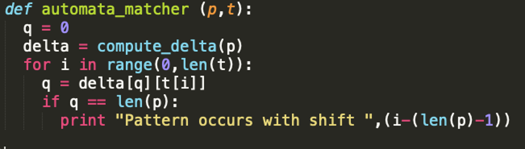

# Boyer-Moore-substring-search
Homework for Formal Languages and Automata subject. We had to implement the Boyer Moore algorithm to search for a substring

# Romanian readme

% **Tema 1 LFA**
% Gherman Maria Irina | 334CB
---

## Introducere
Pentru tema aceasta am încercat să folosesc cât de mult pot calitățile 
limbajului Python. Mi-am definit multe funcții, fiecare cu rolul ei, iar 
main-ul l-am lăsat să arate frumos, curat, cu 3 apeluri de funcții.

## Algoritmul general
Pentru pattern matching-ul efectiv am urmat pas cu pas algoritmul prezentat 
la curs:

&nbsp;
\
&nbsp;

M-am folosit de câteva funcții ajutătoare (pentru a verifica dacă două
string-uri sunt egale, pentru a construi matricea și pentru a face longest
prefix match), care cred că sunt punctul principal de interes al temei și pe
care le voi detalia mai jos.

## Construcția matricei *delta*
Ideea generală după care m-am ghidat a fost aceea de *prefix match*.
Inițial, umplu prima linie a matricei cu 0, în afară de poziția corespunzătoare
primei litere din pattern:

$$
\\delta[\varepsilon][a]= \left\{
\begin{array}{ll}
      1, a = pattern[0]\\
      0, a \neq pattern[0]\\
\end{array} 
\right. 
$$

După asta, iau fiecare substring din pattern (pentru **"LFA"** iau mai întâi 
**"L"**, apoi **"LF"**, apoi **"LFA"**) și îi adaug la final fiecare caracter
posibil pentru a obține fiecare *"caz"* posibil. După ce am string-ul obținut, 
fac longest prefix match și văd ce trebuie scris în matrice.

## Longest prefix match
Pentru a face longest prefix match, iau prima dată cazul ideal: string-ul citit
este fix pattern-ul meu. Dacă nu, atunci iau pattern-ul fără primul caracter, 
fără al doilea etc. Mi-am definit o funcție ajutătoare *"match"* care verifică
dacă două string-uri sunt identice.

Un caz special la care am avut grijă (prin variabila *"index"*) este cazul în
care string-ul citit este mai mare decât pattern-ul. Cazul apare la 
completarea ultimei linii. De exemplu, pentru **"LFA"** o să verific
combinațiile **"LFAA"**, **"LFAB"**, **"LFAC"** etc. 

Cazul acesta l-am tratat astfel: dacă cuvântul citit este mai mare decât 
pattern-ul, verifică doar pentru ultimele *len(pattern)* caractere.
